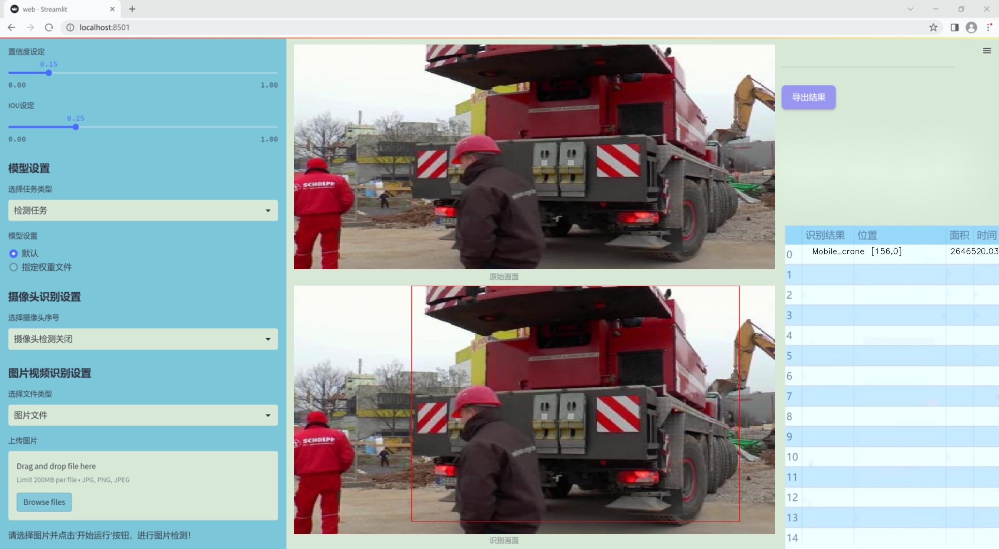

# 改进yolo11-DySnakeConv等200+全套创新点大全：重型设备检测系统源码＆数据集全套

### 1.图片效果展示




##### 项目来源 **[人工智能促进会 2024.10.30](https://kdocs.cn/l/cszuIiCKVNis)**

注意：由于项目一直在更新迭代，上面“1.图片效果展示”和“2.视频效果展示”展示的系统图片或者视频可能为老版本，新版本在老版本的基础上升级如下：（实际效果以升级的新版本为准）

  （1）适配了YOLOV11的“目标检测”模型和“实例分割”模型，通过加载相应的权重（.pt）文件即可自适应加载模型。

  （2）支持“图片识别”、“视频识别”、“摄像头实时识别”三种识别模式。

  （3）支持“图片识别”、“视频识别”、“摄像头实时识别”三种识别结果保存导出，解决手动导出（容易卡顿出现爆内存）存在的问题，识别完自动保存结果并导出到tempDir中。

  （4）支持Web前端系统中的标题、背景图等自定义修改。

  另外本项目提供训练的数据集和训练教程,暂不提供权重文件（best.pt）,需要您按照教程进行训练后实现图片演示和Web前端界面演示的效果。

### 2.视频效果展示

[2.1 视频效果展示](https://www.bilibili.com/video/BV168SLYGEva/)

### 3.背景

研究背景与意义

随着全球经济的快速发展，重型设备在建筑、矿业、交通等多个领域的应用愈加广泛。这些设备的高效使用不仅提高了生产力，也对安全管理和资源配置提出了更高的要求。因此，如何有效地监测和管理重型设备，成为了行业内亟待解决的问题。传统的人工监测方式存在效率低、误差大等缺陷，难以满足现代化生产的需求。基于此，自动化检测系统的研究显得尤为重要。

本研究旨在基于改进的YOLOv11模型，构建一个高效的重型设备检测系统。YOLO（You Only Look Once）系列模型因其快速和准确的目标检测能力，已成为计算机视觉领域的重要工具。通过对YOLOv11进行改进，结合特定的重型设备数据集，我们希望能够显著提升检测精度和实时性。该数据集包含6300张图像，涵盖了包括推土机、重型卡车、挖掘机、平地机、装载机、移动起重机和压路机等多种类别，能够为模型的训练和测试提供丰富的样本。

在重型设备的监测中，准确识别不同类型的设备不仅有助于提高作业效率，还能在一定程度上降低事故发生率，保障工地安全。此外，基于深度学习的自动检测系统能够实时分析设备的运行状态，为设备维护和管理提供数据支持，从而实现智能化管理。因此，本研究的开展不仅具有重要的学术价值，也对推动重型设备行业的智能化转型具有深远的现实意义。通过构建一个高效的重型设备检测系统，我们期望为行业提供一种新的解决方案，促进生产效率的提升和安全管理的优化。

### 4.数据集信息展示

##### 4.1 本项目数据集详细数据（类别数＆类别名）

nc: 7
names: ['Bull_dozer', 'Dumb_truck', 'Excavator', 'Grader', 'Loader', 'Mobile_crane', 'Roller']


该项目为【目标检测】数据集，请在【训练教程和Web端加载模型教程（第三步）】这一步的时候按照【目标检测】部分的教程来训练

##### 4.2 本项目数据集信息介绍

本项目数据集信息介绍

本项目所使用的数据集名为“Heavy_Equipment”，旨在为改进YOLOv11的重型设备检测系统提供丰富的训练数据。该数据集专注于重型设备的识别与分类，涵盖了七个主要类别，分别为：推土机（Bull_dozer）、自卸卡车（Dumb_truck）、挖掘机（Excavator）、平地机（Grader）、装载机（Loader）、移动起重机（Mobile_crane）和压路机（Roller）。这些类别代表了在建筑工地、矿山和其他重型机械作业环境中常见的设备类型，数据集的构建旨在提高模型在实际应用中的识别精度和效率。

“Heavy_Equipment”数据集的设计考虑了多样性和复杂性，包含了不同角度、光照条件和背景环境下的重型设备图像。这种多样性不仅增强了模型的泛化能力，还确保了其在各种实际场景中的适用性。每个类别的样本数量经过精心挑选，以保证数据集的均衡性，避免模型在训练过程中出现偏向某一类别的现象。

此外，数据集中的图像均经过标注，确保每个重型设备的边界框和类别标签准确无误。这一过程为YOLOv11的训练提供了高质量的监督信号，使得模型能够在特征提取和分类任务中表现出色。通过对“Heavy_Equipment”数据集的深入分析与应用，本项目旨在提升重型设备检测系统的性能，推动智能化建设和工业自动化的发展。数据集的丰富性和准确性将为后续的研究和应用奠定坚实的基础。


### 5.全套项目环境部署视频教程（零基础手把手教学）

[5.1 所需软件PyCharm和Anaconda安装教程（第一步）](https://www.bilibili.com/video/BV1BoC1YCEKi/?spm_id_from=333.999.0.0&vd_source=bc9aec86d164b67a7004b996143742dc)


[5.2 安装Python虚拟环境创建和依赖库安装视频教程（第二步）](https://www.bilibili.com/video/BV1ZoC1YCEBw?spm_id_from=333.788.videopod.sections&vd_source=bc9aec86d164b67a7004b996143742dc)

### 6.改进YOLOv11训练教程和Web_UI前端加载模型教程（零基础手把手教学）

[6.1 改进YOLOv11训练教程和Web_UI前端加载模型教程（第三步）](https://www.bilibili.com/video/BV1BoC1YCEhR?spm_id_from=333.788.videopod.sections&vd_source=bc9aec86d164b67a7004b996143742dc)


按照上面的训练视频教程链接加载项目提供的数据集，运行train.py即可开始训练



     Epoch   gpu_mem       box       obj       cls    labels  img_size
     1/200     20.8G   0.01576   0.01955  0.007536        22      1280: 100%|██████████| 849/849 [14:42<00:00,  1.04s/it]
               Class     Images     Labels          P          R     mAP@.5 mAP@.5:.95: 100%|██████████| 213/213 [01:14<00:00,  2.87it/s]
                 all       3395      17314      0.994      0.957      0.0957      0.0843

     Epoch   gpu_mem       box       obj       cls    labels  img_size
     2/200     20.8G   0.01578   0.01923  0.007006        22      1280: 100%|██████████| 849/849 [14:44<00:00,  1.04s/it]
               Class     Images     Labels          P          R     mAP@.5 mAP@.5:.95: 100%|██████████| 213/213 [01:12<00:00,  2.95it/s]
                 all       3395      17314      0.996      0.956      0.0957      0.0845

     Epoch   gpu_mem       box       obj       cls    labels  img_size
     3/200     20.8G   0.01561    0.0191  0.006895        27      1280: 100%|██████████| 849/849 [10:56<00:00,  1.29it/s]
               Class     Images     Labels          P          R     mAP@.5 mAP@.5:.95: 100%|███████   | 187/213 [00:52<00:00,  4.04it/s]
                 all       3395      17314      0.996      0.957      0.0957      0.0845


###### [项目数据集下载链接](https://kdocs.cn/l/cszuIiCKVNis)

### 7.原始YOLOv11算法讲解


##### YOLO11介绍

Ultralytics YOLO11是一款尖端的、最先进的模型，它在之前YOLO版本成功的基础上进行了构建，并引入了新功能和改进，以进一步提升性能和灵活性。
**YOLO11设计快速、准确且易于使用，使其成为各种物体检测和跟踪、实例分割、图像分类以及姿态估计任务的绝佳选择。**


**结构图如下：**


##### **C3k2**

**C3k2，结构图如下**


**C3k2，继承自类`C2f，其中通过c3k设置False或者Ture来决定选择使用C3k还是`**Bottleneck


**实现代码** **ultralytics/nn/modules/block.py**

##### C2PSA介绍

**借鉴V10 PSA结构，实现了C2PSA和C2fPSA，最终选择了基于C2的C2PSA（可能涨点更好？）**


**实现代码** **ultralytics/nn/modules/block.py**

##### Detect介绍

**分类检测头引入了DWConv（更加轻量级，为后续二次创新提供了改进点），结构图如下（和V8的区别）：**


### 8.200+种全套改进YOLOV11创新点原理讲解

#### 8.1 200+种全套改进YOLOV11创新点原理讲解大全

由于篇幅限制，每个创新点的具体原理讲解就不全部展开，具体见下列网址中的改进模块对应项目的技术原理博客网址【Blog】（创新点均为模块化搭建，原理适配YOLOv5~YOLOv11等各种版本）

[改进模块技术原理博客【Blog】网址链接](https://gitee.com/qunmasj/good)


#### 8.2 精选部分改进YOLOV11创新点原理讲解

###### 这里节选部分改进创新点展开原理讲解(完整的改进原理见上图和[改进模块技术原理博客链接](https://gitee.com/qunmasj/good)【如果此小节的图加载失败可以通过CSDN或者Github搜索该博客的标题访问原始博客，原始博客图片显示正常】


### YOLO-MS简介
实时目标检测，以YOLO系列为例，已在工业领域中找到重要应用，特别是在边缘设备（如无人机和机器人）中。与之前的目标检测器不同，实时目标检测器旨在在速度和准确性之间追求最佳平衡。为了实现这一目标，提出了大量的工作：从第一代DarkNet到CSPNet，再到最近的扩展ELAN，随着性能的快速增长，实时目标检测器的架构经历了巨大的变化。

尽管性能令人印象深刻，但在不同尺度上识别对象仍然是实时目标检测器面临的基本挑战。这促使作者设计了一个强大的编码器架构，用于学习具有表现力的多尺度特征表示。具体而言，作者从两个新的角度考虑为实时目标检测编码多尺度特征：

从局部视角出发，作者设计了一个具有简单而有效的分层特征融合策略的MS-Block。受到Res2Net的启发，作者在MS-Block中引入了多个分支来进行特征提取，但不同的是，作者使用了一个带有深度卷积的 Inverted Bottleneck Block块，以实现对大Kernel的高效利用。

从全局视角出发，作者提出随着网络加深逐渐增加卷积的Kernel-Size。作者在浅层使用小Kernel卷积来更高效地处理高分辨率特征。另一方面，在深层中，作者采用大Kernel卷积来捕捉广泛的信息。

基于以上设计原则，作者呈现了作者的实时目标检测器，称为YOLO-MS。为了评估作者的YOLO-MS的性能，作者在MS COCO数据集上进行了全面的实验。还提供了与其他最先进方法的定量比较，以展示作者方法的强大性能。如图1所示，YOLO-MS在计算性能平衡方面优于其他近期的实时目标检测器。


具体而言，YOLO-MS-XS在MS COCO上获得了43%+的AP得分，仅具有450万个可学习参数和8.7亿个FLOPs。YOLO-MS-S和YOLO-MS分别获得了46%+和51%+的AP，可学习参数分别为810万和2220万。此外，作者的工作还可以作为其他YOLO模型的即插即用模块。通常情况下，作者的方法可以将YOLOv11的AP从37%+显著提高到40%+，甚至还可以使用更少的参数和FLOPs。


#### Multi-Scale Building Block Design
CSP Block是一个基于阶段级梯度路径的网络，平衡了梯度组合和计算成本。它是广泛应用于YOLO系列的基本构建块。已经提出了几种变体，包括YOLOv4和YOLOv11中的原始版本，Scaled YOLOv4中的CSPVoVNet，YOLOv11中的ELAN，以及RTMDet中提出的大Kernel单元。作者在图2(a)和图2(b)中分别展示了原始CSP块和ELAN的结构。


上述实时检测器中被忽视的一个关键方面是如何在基本构建块中编码多尺度特征。其中一个强大的设计原则是Res2Net，它聚合了来自不同层次的特征以增强多尺度表示。然而，这一原则并没有充分探索大Kernel卷积的作用，而大Kernel卷积已经在基于CNN的视觉识别任务模型中证明有效。将大Kernel卷积纳入Res2Net的主要障碍在于它们引入的计算开销，因为构建块采用了标准卷积。在作者的方法中，作者提出用 Inverted Bottleneck Block替代标准的3 × 3卷积，以享受大Kernel卷积的好处。

基于前面的分析，作者提出了一个带有分层特征融合策略的全新Block，称为MS-Block，以增强实时目标检测器在提取多尺度特征时的能力，同时保持快速的推理速度。

MS-Block的具体结构如图2(c)所示。假设是输入特征。通过1×1卷积的转换后，X的通道维度增加到n*C。然后，作者将X分割成n个不同的组，表示为，其中。为了降低计算成本，作者选择n为3。

注意，除了之外，每个其他组都经过一个 Inverted Bottleneck Block层，用表示，其中k表示Kernel-Size，以获得。的数学表示如下：


根据这个公式，该博客的作者不将 Inverted Bottleneck Block层连接，使其作为跨阶段连接，并保留来自前面层的信息。最后，作者将所有分割连接在一起，并应用1×1卷积来在所有分割之间进行交互，每个分割都编码不同尺度的特征。当网络加深时，这个1×1卷积也用于调整通道数。

#### Heterogeneous Kernel Selection Protocol
除了构建块的设计外，作者还从宏观角度探讨了卷积的使用。之前的实时目标检测器在不同的编码器阶段采用了同质卷积（即具有相同Kernel-Size的卷积），但作者认为这不是提取多尺度语义信息的最佳选项。

在金字塔结构中，从检测器的浅阶段提取的高分辨率特征通常用于捕捉细粒度语义，将用于检测小目标。相反，来自网络较深阶段的低分辨率特征用于捕捉高级语义，将用于检测大目标。如果作者在所有阶段都采用统一的小Kernel卷积，深阶段的有效感受野（ERF）将受到限制，影响大目标的性能。在每个阶段中引入大Kernel卷积可以帮助解决这个问题。然而，具有大的ERF的大Kernel可以编码更广泛的区域，这增加了在小目标外部包含噪声信息的概率，并且降低了推理速度。

在这项工作中，作者建议在不同阶段中采用异构卷积，以帮助捕获更丰富的多尺度特征。具体来说，在编码器的第一个阶段中，作者采用最小Kernel卷积，而最大Kernel卷积位于最后一个阶段。随后，作者逐步增加中间阶段的Kernel-Size，使其与特征分辨率的增加保持一致。这种策略允许提取细粒度和粗粒度的语义信息，增强了编码器的多尺度特征表示能力。

正如图所示，作者将k的值分别分配给编码器中的浅阶段到深阶段，取值为3、5、7和9。作者将其称为异构Kernel选择（HKS）协议。


作者的HKS协议能够在深层中扩大感受野，而不会对浅层产生任何其他影响。此外，HKS不仅有助于编码更丰富的多尺度特征，还确保了高效的推理。

如表1所示，将大Kernel卷积应用于高分辨率特征会产生较高的计算开销。然而，作者的HKS协议在低分辨率特征上采用大Kernel卷积，从而与仅使用大Kernel卷积相比，大大降低了计算成本。


在实践中，作者经验性地发现，采用HKS协议的YOLO-MS的推理速度几乎与仅使用深度可分离的3 × 3卷积相同。

#### Architecture
如图所示，作者模型的Backbone由4个阶段组成，每个阶段后面跟随1个步长为2的3 × 3卷积进行下采样。在第3个阶段后，作者添加了1个SPP块，与RTMDet中一样。在作者的编码器上，作者使用PAFPN作为Neck来构建特征金字塔[31, 35]。它融合了从Backbone不同阶段提取的多尺度特征。Neck中使用的基本构建块也是作者的MS-Block，在其中使用3 × 3深度可分离卷积进行快速推理。

此外，为了在速度和准确性之间取得更好的平衡，作者将Backbone中多级特征的通道深度减半。作者提供了3个不同尺度的YOLO-MS变体，即YOLO-MS-XS、YOLO-MS-S和YOLO-MS。不同尺度的YOLO-MS的详细配置列在表2中。对于YOLO-MS的其他部分，作者将其保持与RTMDet相同。


### 9.系统功能展示

图9.1.系统支持检测结果表格显示

  图9.2.系统支持置信度和IOU阈值手动调节

  图9.3.系统支持自定义加载权重文件best.pt(需要你通过步骤5中训练获得)

  图9.4.系统支持摄像头实时识别

  图9.5.系统支持图片识别

  图9.6.系统支持视频识别

  图9.7.系统支持识别结果文件自动保存

  图9.8.系统支持Excel导出检测结果数据


### 10. YOLOv11核心改进源码讲解

#### 10.1 VanillaNet.py

以下是经过简化和注释的核心代码，保留了模型的基本结构和重要功能。

```python
import torch
import torch.nn as nn
import torch.nn.functional as F
from timm.layers import weight_init

# 激活函数类，继承自 ReLU
class Activation(nn.ReLU):
    def __init__(self, dim, act_num=3, deploy=False):
        super(Activation, self).__init__()
        self.deploy = deploy
        # 权重初始化
        self.weight = torch.nn.Parameter(torch.randn(dim, 1, act_num * 2 + 1, act_num * 2 + 1))
        self.bn = nn.BatchNorm2d(dim, eps=1e-6)  # 批归一化
        weight_init.trunc_normal_(self.weight, std=.02)

    def forward(self, x):
        # 前向传播
        if self.deploy:
            return F.conv2d(super(Activation, self).forward(x), self.weight, padding=(self.act_num * 2 + 1) // 2, groups=self.dim)
        else:
            return self.bn(F.conv2d(super(Activation, self).forward(x), self.weight, padding=self.act_num, groups=self.dim))

    def switch_to_deploy(self):
        # 将模型切换到部署模式
        if not self.deploy:
            kernel, bias = self._fuse_bn_tensor(self.weight, self.bn)
            self.weight.data = kernel
            self.bias = torch.nn.Parameter(torch.zeros(self.dim))
            self.bias.data = bias
            del self.bn  # 删除批归一化层
            self.deploy = True

    def _fuse_bn_tensor(self, weight, bn):
        # 融合权重和批归一化参数
        running_mean = bn.running_mean
        running_var = bn.running_var
        gamma = bn.weight
        beta = bn.bias
        eps = bn.eps
        std = (running_var + eps).sqrt()
        t = (gamma / std).reshape(-1, 1, 1, 1)
        return weight * t, beta - running_mean * gamma / std

# 基本模块类
class Block(nn.Module):
    def __init__(self, dim, dim_out, act_num=3, stride=2, deploy=False):
        super().__init__()
        self.deploy = deploy
        # 根据是否部署选择不同的卷积层
        if self.deploy:
            self.conv = nn.Conv2d(dim, dim_out, kernel_size=1)
        else:
            self.conv1 = nn.Sequential(
                nn.Conv2d(dim, dim, kernel_size=1),
                nn.BatchNorm2d(dim, eps=1e-6),
            )
            self.conv2 = nn.Sequential(
                nn.Conv2d(dim, dim_out, kernel_size=1),
                nn.BatchNorm2d(dim_out, eps=1e-6)
            )
        self.pool = nn.MaxPool2d(stride) if stride != 1 else nn.Identity()  # 池化层
        self.act = Activation(dim_out, act_num)  # 激活函数

    def forward(self, x):
        # 前向传播
        if self.deploy:
            x = self.conv(x)
        else:
            x = self.conv1(x)
            x = F.leaky_relu(x, negative_slope=1)  # 使用Leaky ReLU
            x = self.conv2(x)

        x = self.pool(x)  # 池化
        x = self.act(x)  # 激活
        return x

    def switch_to_deploy(self):
        # 切换到部署模式
        if not self.deploy:
            # 融合卷积和批归一化
            kernel, bias = self._fuse_bn_tensor(self.conv1[0], self.conv1[1])
            self.conv = self.conv2[0]
            self.conv.weight.data = kernel
            self.conv.bias.data = bias
            del self.conv1
            del self.conv2
            self.act.switch_to_deploy()
            self.deploy = True

# VanillaNet模型类
class VanillaNet(nn.Module):
    def __init__(self, in_chans=3, num_classes=1000, dims=[96, 192, 384, 768], strides=[2, 2, 2, 1], deploy=False):
        super().__init__()
        self.deploy = deploy
        # 根据是否部署选择不同的输入层
        if self.deploy:
            self.stem = nn.Sequential(
                nn.Conv2d(in_chans, dims[0], kernel_size=4, stride=4),
                Activation(dims[0])
            )
        else:
            self.stem1 = nn.Sequential(
                nn.Conv2d(in_chans, dims[0], kernel_size=4, stride=4),
                nn.BatchNorm2d(dims[0], eps=1e-6),
            )
            self.stem2 = nn.Sequential(
                nn.Conv2d(dims[0], dims[0], kernel_size=1, stride=1),
                nn.BatchNorm2d(dims[0], eps=1e-6),
                Activation(dims[0])
            )

        self.stages = nn.ModuleList()
        for i in range(len(strides)):
            stage = Block(dim=dims[i], dim_out=dims[i + 1], stride=strides[i], deploy=deploy)
            self.stages.append(stage)

    def forward(self, x):
        # 前向传播
        if self.deploy:
            x = self.stem(x)
        else:
            x = self.stem1(x)
            x = F.leaky_relu(x, negative_slope=1)
            x = self.stem2(x)

        for stage in self.stages:
            x = stage(x)  # 通过每个Block
        return x

    def switch_to_deploy(self):
        # 切换到部署模式
        if not self.deploy:
            self.stem2[2].switch_to_deploy()
            kernel, bias = self._fuse_bn_tensor(self.stem1[0], self.stem1[1])
            self.stem1[0].weight.data = kernel
            self.stem1[0].bias.data = bias
            self.stem = nn.Sequential(self.stem1[0], self.stem2[2])
            del self.stem1
            del self.stem2

            for stage in self.stages:
                stage.switch_to_deploy()

            self.deploy = True

# 更新模型权重的函数
def update_weight(model_dict, weight_dict):
    for k, v in weight_dict.items():
        if k in model_dict.keys() and model_dict[k].shape == v.shape:
            model_dict[k] = v
    return model_dict

# 生成不同配置的VanillaNet模型
def vanillanet_10(pretrained='', **kwargs):
    model = VanillaNet(dims=[128 * 4, 128 * 4, 256 * 4, 512 * 4, 512 * 4, 512 * 4, 512 * 4, 1024 * 4], **kwargs)
    if pretrained:
        weights = torch.load(pretrained)['model_ema']
        model.load_state_dict(update_weight(model.state_dict(), weights))
    return model

if __name__ == '__main__':
    inputs = torch.randn((1, 3, 640, 640))  # 输入数据
    model = vanillanet_10()  # 创建模型
    pred = model(inputs)  # 前向传播
    for i in pred:
        print(i.size())  # 输出每层的尺寸
```

### 代码说明：
1. **Activation 类**：自定义的激活函数类，包含了权重和批归一化的处理。
2. **Block 类**：构建了基本的卷积块，包含卷积、批归一化和激活函数。
3. **VanillaNet 类**：整个网络结构的实现，包含输入层和多个 Block 组成的阶段。
4. **update_weight 函数**：用于更新模型的权重。
5. **vanillanet_10 函数**：用于创建一个特定配置的 VanillaNet 模型。

通过这些核心部分的实现，可以构建出一个灵活且高效的卷积神经网络。

该文件实现了一个名为 `VanillaNet` 的深度学习模型，主要用于图像处理任务。该模型的设计灵感来自于卷积神经网络（CNN），并通过模块化的方式构建，便于扩展和修改。以下是对代码的详细讲解。

首先，文件开头包含版权信息和许可协议，表明该程序可以在MIT许可证下自由使用和修改。接着，导入了必要的库，包括 PyTorch 和一些特定的模块。

在文件中定义了多个类和函数，其中最重要的类是 `VanillaNet` 和 `Block`。`VanillaNet` 是整个网络的主体，而 `Block` 是构成网络的基本单元。

`activation` 类是一个自定义的激活函数类，继承自 `nn.ReLU`。它在初始化时会创建一个可学习的权重参数，并使用批归一化（Batch Normalization）来提高模型的稳定性和收敛速度。`forward` 方法根据 `deploy` 标志决定是否使用卷积操作。

`Block` 类则是网络的基本构建块。它包含了两个卷积层和一个激活层，此外还可以选择性地使用池化层。`forward` 方法定义了数据在该块中的流动方式，首先通过卷积层，然后经过激活函数，最后经过池化层。

`VanillaNet` 类负责构建整个网络结构。它在初始化时接受输入通道数、类别数、维度列表、丢弃率、激活函数数量、步幅等参数。网络的构建分为多个阶段，每个阶段由多个 `Block` 组成。`forward` 方法定义了输入数据在整个网络中的流动过程，并在特定的尺度下提取特征。

在 `VanillaNet` 中，还有一个重要的功能是权重融合，`switch_to_deploy` 方法可以将训练阶段的模型转换为推理阶段的模型，通过融合批归一化层来提高推理效率。

此外，文件中还定义了一些函数用于创建不同配置的 `VanillaNet` 模型（如 `vanillanet_5` 到 `vanillanet_13`），这些函数允许用户根据需要选择不同的网络结构，并可以加载预训练的权重。

最后，文件的主程序部分提供了一个简单的测试，生成一个随机输入并通过模型进行前向传播，输出每个特征图的尺寸。

整体而言，该文件实现了一个灵活且可扩展的卷积神经网络架构，适用于各种图像处理任务，并提供了预训练模型的加载功能。

#### 10.2 convnextv2.py

以下是经过简化并添加详细中文注释的核心代码部分：

```python
import torch
import torch.nn as nn
import torch.nn.functional as F

class LayerNorm(nn.Module):
    """ 自定义的层归一化（Layer Normalization）模块，支持两种数据格式：channels_last 和 channels_first。 """
    def __init__(self, normalized_shape, eps=1e-6, data_format="channels_last"):
        super().__init__()
        # 权重和偏置参数
        self.weight = nn.Parameter(torch.ones(normalized_shape))
        self.bias = nn.Parameter(torch.zeros(normalized_shape))
        self.eps = eps  # 防止除零的一个小常数
        self.data_format = data_format  # 数据格式
        if self.data_format not in ["channels_last", "channels_first"]:
            raise NotImplementedError 
        self.normalized_shape = (normalized_shape, )
    
    def forward(self, x):
        # 根据数据格式进行归一化
        if self.data_format == "channels_last":
            return F.layer_norm(x, self.normalized_shape, self.weight, self.bias, self.eps)
        elif self.data_format == "channels_first":
            u = x.mean(1, keepdim=True)  # 计算均值
            s = (x - u).pow(2).mean(1, keepdim=True)  # 计算方差
            x = (x - u) / torch.sqrt(s + self.eps)  # 标准化
            x = self.weight[:, None, None] * x + self.bias[:, None, None]  # 应用权重和偏置
            return x

class Block(nn.Module):
    """ ConvNeXtV2 的基本模块，包含深度可分离卷积和其他层。 """
    def __init__(self, dim, drop_path=0.):
        super().__init__()
        # 深度可分离卷积
        self.dwconv = nn.Conv2d(dim, dim, kernel_size=7, padding=3, groups=dim)
        self.norm = LayerNorm(dim, eps=1e-6)  # 归一化层
        self.pwconv1 = nn.Linear(dim, 4 * dim)  # 1x1 卷积
        self.act = nn.GELU()  # 激活函数
        self.pwconv2 = nn.Linear(4 * dim, dim)  # 1x1 卷积
        self.drop_path = nn.Identity() if drop_path <= 0. else DropPath(drop_path)  # 随机深度

    def forward(self, x):
        input = x  # 保存输入以便后续残差连接
        x = self.dwconv(x)  # 深度卷积
        x = x.permute(0, 2, 3, 1)  # 转换维度顺序
        x = self.norm(x)  # 归一化
        x = self.pwconv1(x)  # 1x1 卷积
        x = self.act(x)  # 激活
        x = self.pwconv2(x)  # 1x1 卷积
        x = x.permute(0, 3, 1, 2)  # 恢复维度顺序
        x = input + self.drop_path(x)  # 残差连接
        return x

class ConvNeXtV2(nn.Module):
    """ ConvNeXt V2 模型定义，包含多个阶段和模块。 """
    def __init__(self, in_chans=3, num_classes=1000, 
                 depths=[3, 3, 9, 3], dims=[96, 192, 384, 768], 
                 drop_path_rate=0.):
        super().__init__()
        self.downsample_layers = nn.ModuleList()  # 下采样层
        # 初始卷积层
        stem = nn.Sequential(
            nn.Conv2d(in_chans, dims[0], kernel_size=4, stride=4),
            LayerNorm(dims[0], eps=1e-6, data_format="channels_first")
        )
        self.downsample_layers.append(stem)
        # 添加后续的下采样层
        for i in range(3):
            downsample_layer = nn.Sequential(
                LayerNorm(dims[i], eps=1e-6, data_format="channels_first"),
                nn.Conv2d(dims[i], dims[i+1], kernel_size=2, stride=2),
            )
            self.downsample_layers.append(downsample_layer)

        self.stages = nn.ModuleList()  # 特征提取阶段
        for i in range(4):
            stage = nn.Sequential(
                *[Block(dim=dims[i]) for _ in range(depths[i])]
            )
            self.stages.append(stage)

        self.norm = nn.LayerNorm(dims[-1], eps=1e-6)  # 最后的归一化层
        self.head = nn.Linear(dims[-1], num_classes)  # 分类头

    def forward(self, x):
        """ 前向传播，经过下采样和特征提取阶段。 """
        for i in range(4):
            x = self.downsample_layers[i](x)  # 下采样
            x = self.stages[i](x)  # 特征提取
        return x  # 返回最后的特征图
```

### 代码核心部分解释：
1. **LayerNorm**: 自定义的层归一化模块，支持不同的数据格式（通道在最后或在最前），用于提高模型的稳定性和收敛速度。
2. **Block**: ConvNeXtV2 的基本构建块，包含深度可分离卷积、归一化、激活和残差连接，构成了网络的基本单元。
3. **ConvNeXtV2**: 主模型类，定义了整个网络的结构，包括下采样层和多个特征提取阶段，最终输出分类结果。

这个程序文件定义了一个名为 `ConvNeXtV2` 的深度学习模型，主要用于图像分类任务。该模型基于卷积神经网络（CNN）的架构，结合了一些现代的设计理念，如层归一化（Layer Normalization）、全局响应归一化（Global Response Normalization）和随机深度（Stochastic Depth）等。

首先，文件中导入了必要的库，包括 PyTorch 和一些辅助函数。接着，定义了几个类。

`LayerNorm` 类实现了层归一化，支持两种数据格式：`channels_last` 和 `channels_first`。它根据输入数据的维度格式选择不同的归一化方式，以便在不同的网络架构中灵活使用。

`GRN` 类实现了全局响应归一化层，它通过计算输入特征的 L2 范数来进行归一化，并引入了可学习的参数 `gamma` 和 `beta`，以增强模型的表达能力。

`Block` 类是 ConvNeXtV2 的基本构建块，包含深度可分离卷积、层归一化、点卷积、激活函数（GELU）和全局响应归一化。每个块的输入经过一系列变换后与输入相加，形成残差连接，这有助于缓解深层网络中的梯度消失问题。

`ConvNeXtV2` 类是整个模型的主体，包含多个阶段，每个阶段由多个 `Block` 组成。模型的构造过程中，首先定义了输入层和下采样层，然后依次添加各个阶段的特征提取块。模型的最后一层是一个线性层，用于将特征映射到类别空间。

在模型的初始化过程中，还定义了权重初始化的方法 `_init_weights`，确保卷积层和线性层的权重以合适的方式初始化。

文件还定义了一些函数，如 `update_weight`，用于更新模型的权重，以便在加载预训练模型时进行参数匹配。接下来的函数 `convnextv2_atto`、`convnextv2_femto` 等是模型的不同变体，分别对应不同的深度和宽度配置。这些函数允许用户创建具有不同复杂度的 ConvNeXtV2 模型，并可以选择加载预训练的权重。

总的来说，这个文件实现了一个灵活且高效的卷积神经网络架构，适用于各种图像分类任务，并提供了多种模型变体以满足不同的需求。

#### 10.3 head.py

以下是经过简化和注释的核心代码部分，主要保留了 `Detect_DyHead` 类及其核心功能：

```python
import torch
import torch.nn as nn
import math

class Detect_DyHead(nn.Module):
    """YOLOv8 检测头，使用动态头进行目标检测。"""
    
    def __init__(self, nc=80, hidc=256, block_num=2, ch=()):
        """
        初始化检测头。
        
        参数:
        nc (int): 类别数量。
        hidc (int): 隐藏层通道数。
        block_num (int): 动态头块的数量。
        ch (tuple): 输入通道数的元组。
        """
        super().__init__()
        self.nc = nc  # 类别数量
        self.nl = len(ch)  # 检测层数量
        self.reg_max = 16  # DFL 通道数
        self.no = nc + self.reg_max * 4  # 每个锚点的输出数量
        self.stride = torch.zeros(self.nl)  # 在构建时计算的步幅
        c2, c3 = max((16, ch[0] // 4, self.reg_max * 4)), max(ch[0], self.nc)  # 通道数
        self.conv = nn.ModuleList(nn.Sequential(Conv(x, hidc, 1)) for x in ch)  # 卷积层
        self.dyhead = nn.Sequential(*[DyHeadBlock(hidc) for _ in range(block_num)])  # 动态头块
        self.cv2 = nn.ModuleList(
            nn.Sequential(Conv(hidc, c2, 3), Conv(c2, c2, 3), nn.Conv2d(c2, 4 * self.reg_max, 1)) for _ in ch
        )  # 生成框的卷积层
        self.cv3 = nn.ModuleList(
            nn.Sequential(
                nn.Sequential(DWConv(hidc, x, 3), Conv(x, c3, 1)),
                nn.Sequential(DWConv(c3, c3, 3), Conv(c3, c3, 1)),
                nn.Conv2d(c3, self.nc, 1),
            )
            for x in ch
        )  # 类别预测的卷积层
        self.dfl = DFL(self.reg_max) if self.reg_max > 1 else nn.Identity()  # DFL层

    def forward(self, x):
        """连接并返回预测的边界框和类别概率。"""
        for i in range(self.nl):
            x[i] = self.conv[i](x[i])  # 通过卷积层处理输入
        x = self.dyhead(x)  # 通过动态头处理特征
        shape = x[0].shape  # 获取特征图的形状
        for i in range(self.nl):
            # 连接生成框和类别预测的输出
            x[i] = torch.cat((self.cv2[i](x[i]), self.cv3[i](x[i])), 1)
        if self.training:
            return x  # 如果在训练模式下，返回所有输出
        else:
            # 动态锚点生成
            self.anchors, self.strides = (x.transpose(0, 1) for x in make_anchors(x, self.stride, 0.5))
            self.shape = shape

        # 将输出展平并分割为边界框和类别
        x_cat = torch.cat([xi.view(shape[0], self.no, -1) for xi in x], 2)
        box, cls = x_cat.split((self.reg_max * 4, self.nc), 1)  # 分割边界框和类别
        dbox = dist2bbox(self.dfl(box), self.anchors.unsqueeze(0), xywh=True, dim=1) * self.strides  # 解码边界框
        y = torch.cat((dbox, cls.sigmoid()), 1)  # 返回边界框和类别概率
        return y

    def bias_init(self):
        """初始化检测头的偏置，警告：需要步幅可用。"""
        for a, b, s in zip(self.cv2, self.cv3, self.stride):
            a[-1].bias.data[:] = 1.0  # 边界框偏置
            b[-1].bias.data[:self.nc] = math.log(5 / self.nc / (640 / s) ** 2)  # 类别偏置
```

### 代码说明：
1. **类的定义**：`Detect_DyHead` 是一个继承自 `nn.Module` 的类，主要用于目标检测。
2. **初始化方法**：构造函数中定义了模型的参数，包括类别数量、隐藏层通道数、动态头块数量等，并初始化了各个卷积层。
3. **前向传播方法**：`forward` 方法处理输入特征，经过卷积层和动态头块后，生成边界框和类别概率。
4. **偏置初始化**：`bias_init` 方法用于初始化模型的偏置项，以便在训练时提供更好的起始值。

这个简化版本保留了 YOLOv8 检测头的核心功能，适合用于目标检测任务。

这个程序文件 `head.py` 是一个用于目标检测模型的实现，主要基于 YOLOv8（You Only Look Once）架构。该文件包含多个类，每个类实现了不同的检测头，负责处理输入特征并生成检测结果。以下是对文件中主要内容的详细说明。

首先，文件导入了一些必要的库，包括 PyTorch 和一些自定义模块。接着，定义了一个 `__all__` 列表，列出了该模块中可以被外部导入的类。

文件中定义的主要类是 `Detect_DyHead`，它实现了 YOLOv8 的检测头，采用了动态头（DyHead）结构。该类的构造函数初始化了一些参数，如类别数量、隐藏通道数、块数量等。它还定义了多个卷积层和动态头模块，用于处理输入特征并生成边界框和类别概率。

`Detect_DyHead` 类的 `forward` 方法是该类的核心，负责将输入特征传递通过各个卷积层，生成预测的边界框和类别概率。在训练模式下，它直接返回处理后的特征；在推理模式下，它会根据输入的形状动态生成锚框，并计算最终的边界框和类别概率。

此外，文件中还定义了多个其他检测头类，如 `Detect_DyHeadWithDCNV3`、`Detect_AFPN_P345`、`Detect_Efficient` 等。这些类通常是对 `Detect_DyHead` 的扩展或变体，采用不同的结构或技术来提高检测性能。例如，`Detect_AFPN_P345` 使用了自适应特征金字塔网络（AFPN），而 `Detect_Efficient` 则是一个更轻量级的实现。

每个检测头类都实现了类似的 `forward` 方法，处理输入特征并生成预测结果。许多类还实现了 `bias_init` 方法，用于初始化偏置，以便在训练时提供更好的起始值。

在文件的后半部分，定义了一些用于特定任务的检测头类，如 `Detect_LSCD`、`Detect_LSDECD`、`Detect_LADH` 等。这些类针对不同的应用场景（如轻量级检测、旋转检测等）进行了优化，提供了更为灵活的结构和功能。

总的来说，这个文件是 YOLOv8 模型中检测头的实现，包含了多种不同的检测头类，每个类都有其特定的功能和用途，适用于不同的目标检测任务。通过这些类，用户可以根据需求选择合适的检测头来构建和训练目标检测模型。

#### 10.4 val.py

以下是经过简化和注释的核心代码部分，主要集中在YOLO检测验证器的实现上：

```python
import os
import torch
from ultralytics.engine.validator import BaseValidator
from ultralytics.utils.metrics import DetMetrics, ConfusionMatrix
from ultralytics.utils import ops

class DetectionValidator(BaseValidator):
    """
    检测验证器类，继承自BaseValidator，用于基于检测模型的验证。
    """

    def __init__(self, dataloader=None, save_dir=None, pbar=None, args=None, _callbacks=None):
        """初始化检测模型所需的变量和设置。"""
        super().__init__(dataloader, save_dir, pbar, args, _callbacks)
        self.metrics = DetMetrics(save_dir=self.save_dir)  # 初始化检测指标
        self.confusion_matrix = ConfusionMatrix(nc=len(args.names), conf=args.conf)  # 初始化混淆矩阵

    def preprocess(self, batch):
        """对图像批次进行预处理，准备输入模型。"""
        batch["img"] = batch["img"].to(self.device, non_blocking=True)  # 将图像转移到设备上
        batch["img"] = batch["img"].float() / 255  # 归一化图像
        for k in ["batch_idx", "cls", "bboxes"]:
            batch[k] = batch[k].to(self.device)  # 将其他数据转移到设备上
        return batch

    def postprocess(self, preds):
        """对预测结果应用非极大值抑制（NMS）。"""
        return ops.non_max_suppression(
            preds,
            self.args.conf,
            self.args.iou,
            multi_label=True,
            max_det=self.args.max_det,
        )

    def update_metrics(self, preds, batch):
        """更新检测指标。"""
        for si, pred in enumerate(preds):
            self.seen += 1  # 记录已处理的样本数量
            pbatch = self._prepare_batch(si, batch)  # 准备当前批次的真实标签
            cls, bbox = pbatch.pop("cls"), pbatch.pop("bbox")  # 获取真实类别和边界框

            if len(pred) == 0:  # 如果没有预测结果
                continue

            predn = self._prepare_pred(pred, pbatch)  # 准备预测结果
            # 处理预测结果与真实标签的匹配
            self.metrics.process(predn, bbox, cls)  # 更新指标

    def get_stats(self):
        """返回指标统计信息和结果字典。"""
        stats = self.metrics.results_dict  # 获取指标结果
        return stats

    def print_results(self):
        """打印每个类别的训练/验证集指标。"""
        LOGGER.info(f"Results: {self.metrics.mean_results()}")  # 打印平均结果

    def _prepare_batch(self, si, batch):
        """准备一批图像和注释用于验证。"""
        idx = batch["batch_idx"] == si  # 获取当前样本的索引
        cls = batch["cls"][idx].squeeze(-1)  # 获取当前样本的类别
        bbox = batch["bboxes"][idx]  # 获取当前样本的边界框
        return dict(cls=cls, bbox=bbox)  # 返回准备好的数据

    def _prepare_pred(self, pred, pbatch):
        """准备预测结果以便于后续处理。"""
        predn = pred.clone()  # 克隆预测结果
        return predn  # 返回处理后的预测结果
```

### 代码注释说明：
1. **DetectionValidator类**：该类用于处理YOLO模型的验证，继承自`BaseValidator`。
2. **__init__方法**：初始化检测验证器，设置必要的指标和混淆矩阵。
3. **preprocess方法**：对输入的图像批次进行预处理，包括设备转移和归一化。
4. **postprocess方法**：应用非极大值抑制，过滤掉冗余的预测框。
5. **update_metrics方法**：更新检测指标，处理每个批次的预测结果与真实标签的匹配。
6. **get_stats方法**：返回当前的指标统计信息。
7. **print_results方法**：打印每个类别的验证结果。
8. **_prepare_batch方法**：准备当前批次的真实标签和边界框。
9. **_prepare_pred方法**：准备预测结果，便于后续处理。

这些核心部分和注释能够帮助理解YOLO检测验证器的工作流程和功能。

这个程序文件 `val.py` 是一个用于目标检测模型验证的类 `DetectionValidator` 的实现，继承自 `BaseValidator`。它主要用于处理 YOLO（You Only Look Once）模型的验证过程，包括数据预处理、模型评估、结果统计和可视化等功能。

在初始化时，`DetectionValidator` 类会设置一些必要的变量和参数，例如数据加载器、保存目录、进度条、命令行参数等。它还会初始化一些用于评估的指标，如检测精度和混淆矩阵，并设置 IOU（Intersection over Union）阈值用于计算 mAP（mean Average Precision）。

`preprocess` 方法负责对输入的图像批次进行预处理，包括将图像数据转换为适合模型输入的格式，并将目标框的坐标进行缩放。该方法还会根据设置保存用于自动标注的标签。

`init_metrics` 方法用于初始化评估指标，检查数据集是否为 COCO 格式，并根据模型的类别名称设置相应的参数。

`postprocess` 方法应用非极大值抑制（NMS）来处理模型的预测输出，以去除冗余的检测框。

`update_metrics` 方法在每个批次的预测后更新评估指标，计算正确预测的数量，并将结果保存到指定的文件中。

`finalize_metrics` 方法用于设置最终的指标值，准备打印和可视化结果。

`get_stats` 方法返回评估的统计信息和结果字典，计算每个类别的目标数量。

`print_results` 方法负责打印训练或验证集的每个类别的指标，包括图像数量、实例数量和各种评估指标的平均值。

`build_dataset` 和 `get_dataloader` 方法用于构建数据集和数据加载器，以便在验证过程中加载图像和标签。

`plot_val_samples` 和 `plot_predictions` 方法用于可视化验证样本和模型的预测结果，并将其保存为图像文件。

`save_one_txt` 方法将 YOLO 检测结果保存为特定格式的文本文件，而 `pred_to_json` 方法则将预测结果序列化为 COCO JSON 格式。

最后，`eval_json` 方法用于评估 YOLO 输出的 JSON 格式，并返回性能统计信息，使用 pycocotools 计算 mAP 值。

整体而言，这个文件提供了一个完整的框架，用于对 YOLO 模型进行验证和评估，涵盖了从数据预处理到结果输出的各个环节。

注意：由于此博客编辑较早，上面“10.YOLOv11核心改进源码讲解”中部分代码可能会优化升级，仅供参考学习，以“11.完整训练+Web前端界面+200+种全套创新点源码、数据集获取”的内容为准。

### 11.完整训练+Web前端界面+200+种全套创新点源码、数据集获取


# [下载链接：https://mbd.pub/o/bread/Zp6Zkp1r](https://mbd.pub/o/bread/Zp6Zkp1r)